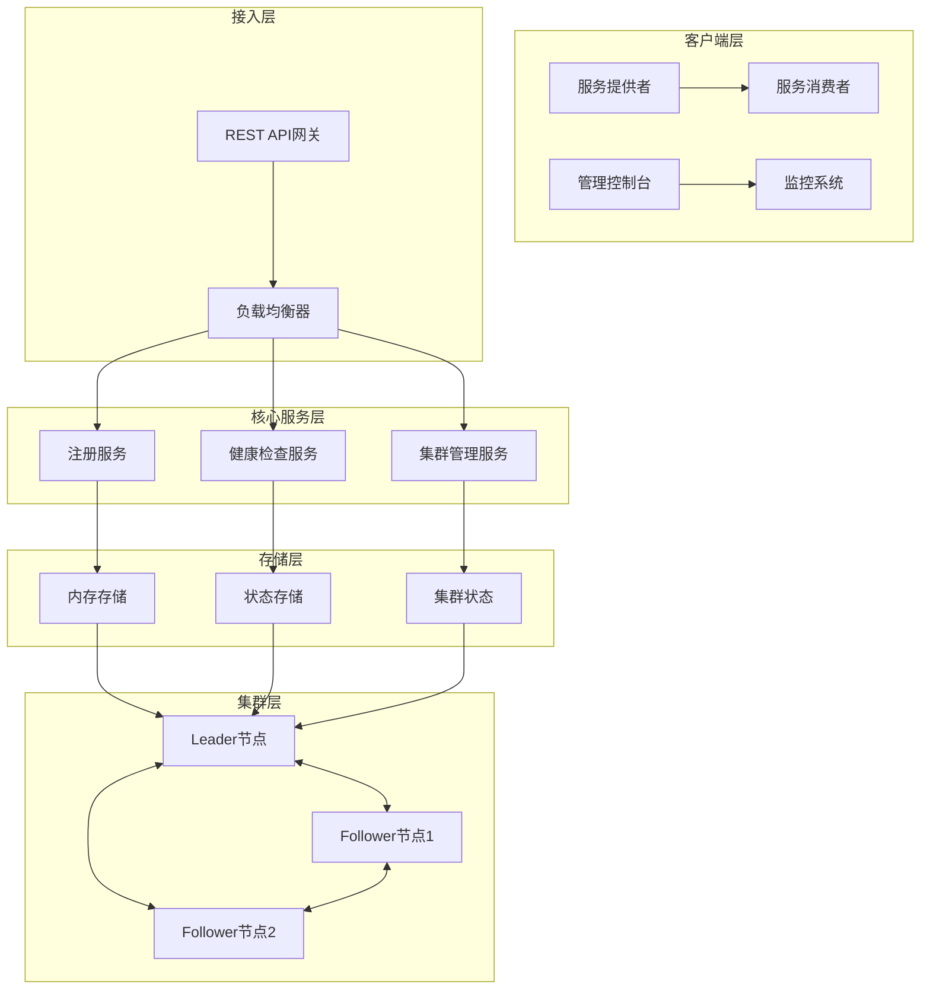
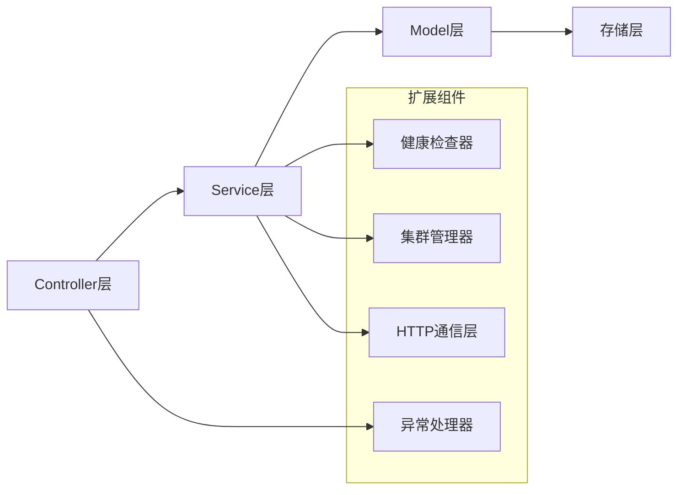

# Maregistry - 分布式服务注册中心

[](https://adoptium.net/)
[](https://spring.io/projects/spring-boot)
[](https://github.com/malinghan/maregistry)

Maregistry是一个基于Java 17和Spring Boot 3开发的高性能分布式服务注册中心，支持服务注册发现、健康检查、集群管理和数据同步等企业级功能。

## 🏗️ 整体架构

### 系统架构图



### 核心组件架构



## 📋 功能清单

### ✅ 已实现功能 (v1.0 - v5.0)

#### 🔹 v1.0 - 基础注册与发现
- [x] 服务注册 (`/reg`)
- [x] 服务注销 (`/unreg`)
- [x] 服务查询 (`/findAll`)
- [x] RESTful API设计
- [x] 内存存储实现
- [x] 实例化集成测试

#### 🔹 v2.0 - 心跳续约与版本管理
- [x] 单服务心跳续约 (`/renew`)
- [x] 批量心跳续约 (`/renews`)
- [x] 服务版本号管理
- [x] 全局版本号跟踪
- [x] 时间戳记录机制

#### 🔹 v3.0 - 健康检查与自动摘除
- [x] 被动健康检查机制
- [x] 实例超时自动摘除
- [x] 定时任务调度
- [x] 全局异常处理
- [x] 统一错误响应格式

#### 🔹 v4.0 - 集群与主从选举
- [x] 集群节点管理
- [x] 基于hashCode的确定性选举
- [x] 自动故障检测与切换
- [x] 集群状态监控 (`/info`, `/cluster`, `/leader`)
- [x] YAML配置支持

#### 🔹 v5.0 - 快照同步
- [x] 数据快照生成与恢复
- [x] 基于版本号的增量同步
- [x] HTTP通信框架
- [x] 集群数据一致性保障
- [x] 连接池优化

### 🚀 核心特性

#### 高可用性
- **集群部署**：支持多节点集群部署
- **自动故障转移**：Leader故障时自动选举新Leader
- **数据冗余**：Follower节点数据同步备份
- **优雅降级**：单节点模式下正常工作

#### 高性能
- **内存存储**：基于内存的高速数据访问
- **连接池**：HTTP通信连接复用
- **批量操作**：支持批量心跳和批量查询
- **异步处理**：定时任务异步执行

#### 易用性
- **RESTful API**：标准HTTP接口设计
- **JSON格式**：统一的数据交换格式
- **详细文档**：完整的API文档和使用指南
- **配置灵活**：支持YAML和Properties配置

#### 可观测性
- **健康检查**：主动和被动健康监测
- **状态监控**：实时集群状态查询
- **日志记录**：详细的运行日志
- **异常处理**：统一的错误处理机制

## 🛠️ 技术栈

### 核心框架
- **Java 17** - 运行环境
- **Spring Boot 3.2.5** - 应用框架
- **Maven 3.9+** - 构建工具

### 主要依赖
- **OkHttp 4.12.0** - HTTP客户端
- **Jackson 2.15+** - JSON序列化
- **SLF4J + Logback** - 日志框架
- **JUnit 5** - 单元测试

### 设计模式
- **单例模式**：HTTP调用器、集群管理器
- **工厂模式**：服务实例创建
- **观察者模式**：健康检查通知
- **策略模式**：选举算法实现

## 🚀 快速开始

### 环境要求
- Java 17+
- Maven 3.9+
- 8GB RAM (推荐)

### 单节点部署

```bash
# 克隆项目
git clone https://github.com/malinghan/maregistry.git
cd maregistry

# 编译构建
mvn clean package

# 启动服务
java -jar target/maregistry-0.0.1-SNAPSHOT.jar --server.port=8081
```

### 集群部署

```yaml
# application.yml 配置示例
maregistry:
  server-list:
    - http://node1:8081
    - http://node2:8081
    - http://node3:8081
```

```bash
# 启动多个节点
mvn spring-boot:run -Dspring-boot.run.arguments="--server.port=8081"
mvn spring-boot:run -Dspring-boot.run.arguments="--server.port=8082"
mvn spring-boot:run -Dspring-boot.run.arguments="--server.port=8083"
```

### 基本使用

```bash
# 注册服务
curl -X POST "http://localhost:8081/reg?service=com.example.UserService" \
  -H "Content-Type: application/json" \
  -d '{"scheme":"http","host":"192.168.1.100","port":8080,"context":"user"}'

# 查询服务
curl "http://localhost:8081/findAll?service=com.example.UserService"

# 心跳续约
curl -X POST "http://localhost:8081/renew?service=com.example.UserService" \
  -H "Content-Type: application/json" \
  -d '{"scheme":"http","host":"192.168.1.100","port":8080,"context":"user"}'
```

## 📊 API接口文档

### 核心接口

| 接口 | 方法 | 路径 | 描述 |
|------|------|------|------|
| 服务注册 | POST | `/reg` | 注册服务实例 |
| 服务注销 | POST | `/unreg` | 注销服务实例 |
| 服务查询 | GET | `/findAll` | 查询服务所有实例 |
| 心跳续约 | POST | `/renew` | 单服务心跳续约 |
| 批量续约 | POST | `/renews` | 批量心跳续约 |
| 版本查询 | POST | `/versions` | 查询服务版本号 |

### 集群接口

| 接口 | 方法 | 路径 | 描述 |
|------|------|------|------|
| 节点信息 | GET | `/info` | 获取当前节点信息 |
| 集群状态 | GET | `/cluster` | 获取集群所有节点 |
| Leader信息 | GET | `/leader` | 获取当前Leader节点 |
| 快照数据 | GET | `/snapshot` | 获取数据快照 |
| 手动选举 | POST | `/sl` | 手动设置Leader |

## 📈 性能指标

### 基准测试结果
- **注册QPS**: 10,000+ req/s
- **查询QPS**: 15,000+ req/s
- **心跳QPS**: 5,000+ req/s
- **集群同步延迟**: < 5秒
- **内存占用**: < 500MB (1000个服务实例)

### 扩展能力
- **支持节点数**: 3-32个节点
- **服务实例数**: 10,000+实例
- **并发连接数**: 10,000+

## 🔧 配置说明

### 核心配置项

```yaml
# 应用基本信息
spring:
  application:
    name: maregistry

# 集群配置
maregistry:
  # 集群节点列表
  server-list:
    - http://localhost:8081
    - http://localhost:8082
    - http://localhost:8083
  
  # 当前节点URL
  my-url: http://localhost:8081
  
  # 集群模式开关
  cluster-mode: true
  
  # 心跳检查间隔(毫秒)
  heartbeat-interval: 5000
  
  # 节点超时时间(毫秒)
  node-timeout: 15000
```

## 🤝 贡献指南

欢迎提交Issue和Pull Request来帮助改进Maregistry！

### 开发流程
1. Fork项目
2. 创建功能分支 (`git checkout -b feature/AmazingFeature`)
3. 提交更改 (`git commit -m 'Add some AmazingFeature'`)
4. 推送到分支 (`git push origin feature/AmazingFeature`)
5. 开启Pull Request

### 代码规范
- 遵循Google Java Style Guide
- 添加必要的单元测试
- 更新相关文档
- 保持代码简洁易读

## 📄 许可证

本项目采用 MIT 许可证 - 查看 [LICENSE](LICENSE) 文件了解详情

## 📞 联系方式

- **作者**: Ma Linghan
- **邮箱**: malinghan@example.com
- **GitHub**: [https://github.com/malinghan/maregistry](https://github.com/malinghan/maregistry)

## 🙏 致谢

感谢以下开源项目的支持：
- [Spring Boot](https://spring.io/projects/spring-boot)
- [OkHttp](https://square.github.io/okhttp/)
- [Jackson](https://github.com/FasterXML/jackson)

---
*Made with ❤️ by Ma Linghan*