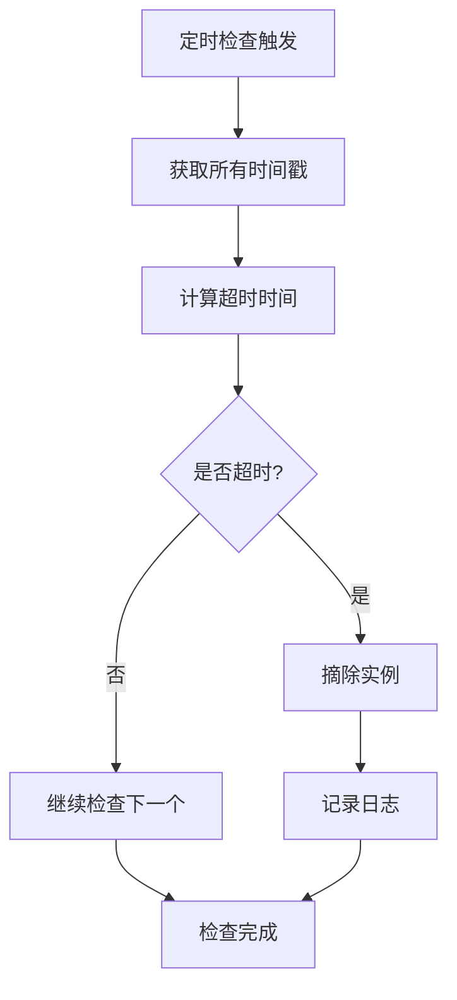

# v3.0 — 健康检查与自动摘除

## 代码结构

```
src/main/java/com/malinghan/maregistry/
├── MaregistryApplication.java          # Spring Boot 入口
├── MaRegistryController.java           # REST 控制器（无变化）
├── MaRegistryConfig.java               # 新增：Bean配置类
├── MaExceptionHandler.java             # 新增：全局异常处理器
├── ExceptionResponse.java              # 新增：异常响应封装类
├── model/
│   └── InstanceMeta.java               # 服务实例数据模型（无变化）
├── service/
│   ├── RegistryService.java            # 注册服务接口（无变化）
│   └── MaRegistryService.java          # 内存实现，新增getTimestamps方法
└── health/
    ├── HealthChecker.java              # 新增：健康检查接口
    └── MaHealthChecker.java            # 新增：健康检查实现类
```

## 核心功能实现

### 1. 健康检查机制

#### 被动健康检查设计
```
核心理念：依赖服务实例主动上报心跳
检查方式：基于时间戳的超时检测
检查频率：每10秒执行一次全量检查
超时阈值：20秒未收到心跳视为不健康
```

#### 时间戳管理增强
在`MaRegistryService`中新增方法：
```java
public Map<String, Long> getTimestamps() {
    return TIMESTAMPS;
}
```

### 2. 健康检查器实现

#### 核心组件
- **HealthChecker接口**：定义健康检查的标准契约
- **MaHealthChecker实现类**：基于ScheduledExecutorService的定时检查实现
- **生命周期管理**：通过Spring Bean的initMethod/destroyMethod自动管理

#### 检查逻辑流程


### 3. 异常处理体系

#### 全局异常处理器
- **MaExceptionHandler**：统一处理各种运行时异常
- **ExceptionResponse**：标准化的错误响应格式
- **多层次异常处理**：针对不同类型异常提供专门处理逻辑

#### 异常分类处理
```java
// 运行时异常 - 500 Internal Server Error
// 非法参数异常 - 400 Bad Request  
// 空指针异常 - 500 Internal Server Error
// 服务不可用异常 - 503 Service Unavailable
// 健康检查异常 - 503 Service Unavailable
```

### 4. 配置管理

#### 自动化生命周期管理
```java
@Configuration
public class MaRegistryConfig {
    @Bean(initMethod = "start", destroyMethod = "stop")
    public HealthChecker healthChecker() {
        return new MaHealthChecker();
    }
}
```

## 测试流程

### 启动服务实例

```bash
# 构建项目
mvn clean package

# 启动服务（端口8081）
java -jar target/maregistry-0.0.1-SNAPSHOT.jar --server.port=8081
```

启动日志应显示：
```
INFO ... : 启动健康检查器，检查间隔: 10秒，超时阈值: 20000毫秒
INFO ... : 健康检查器启动成功
```

### 功能测试步骤

#### 1. 基础注册与心跳测试
首先注册一个服务实例并发送心跳：

```bash
# 注册用户服务
curl -X POST "http://localhost:8081/reg?service=com.malinghan.UserService" \
  -H "Content-Type: application/json" \
  -d '{
    "scheme": "http",
    "host": "192.168.1.100",
    "port": 8080,
    "context": "userservice"
  }'

# 发送心跳续约
curl -X POST "http://localhost:8081/renew?service=com.malinghan.UserService" \
  -H "Content-Type: application/json" \
  -d '{
    "scheme": "http",
    "host": "192.168.1.100",
    "port": 8080,
    "context": "userservice"
  }'
```

#### 2. 健康检查观察测试
注册实例后不发送心跳，观察自动摘除：

```bash
# 注册一个新实例（不发送心跳）
curl -X POST "http://localhost:8081/reg?service=com.malinghan.TestService" \
  -H "Content-Type: application/json" \
  -d '{
    "scheme": "http",
    "host": "192.168.1.102",
    "port": 7070,
    "context": "testservice"
  }'

# 查询实例确认注册成功
curl "http://localhost:8081/findAll?service=com.malinghan.TestService"
```

等待20秒后再次查询：
```bash
# 应该返回空数组，实例已被自动摘除
curl "http://localhost:8081/findAll?service=com.malinghan.TestService"
```

#### 3. 日志验证测试
观察应用日志中的健康检查信息：

```
# 健康检查启动日志
INFO ... : 启动健康检查器，检查间隔: 10秒，超时阈值: 20000毫秒
INFO ... : 健康检查器启动成功

# 健康检查执行日志
DEBUG ... : 开始执行健康检查
DEBUG ... : 健康检查完成: 检查X个实例，无超时实例

# 实例摘除日志（当有超时实例时）
INFO ... : 发现超时实例: com.malinghan.TestService@http://192.168.1.102:7070/testservice, 超时时间: 25000ms
INFO ... : 摘除超时实例: com.malinghan.TestService@http://192.168.1.102:7070/testservice
INFO ... : 健康检查完成: 检查X个实例，摘除1个超时实例
```

#### 4. 异常处理测试
测试各种异常场景的处理：

```bash
# 测试非法参数
curl -X POST "http://localhost:8081/reg?service=" \
  -H "Content-Type: application/json" \
  -d '{}'

# 应该返回400 Bad Request的标准化错误响应
```

### 预期测试结果

#### 正常场景
- ✅ 健康检查器自动启动并周期性执行
- ✅ 活跃实例保持注册状态
- ✅ 超时实例（>20秒未续约）自动被摘除
- ✅ 日志记录完整准确

#### 异常场景
- ✅ 非法参数返回400错误和标准化响应
- ✅ 系统异常返回500错误和详细日志
- ✅ 健康检查异常返回503服务不可用

## 关键设计特点

### 1. 被动健康检查优势
- **低开销**：无需主动探测，减少网络流量
- **实时性**：实例主动上报，状态更新及时
- **简单可靠**：基于时间戳的简单算法，不易出错

### 2. 灵活的定时任务
- **ScheduledExecutorService**：比Spring @Scheduled更灵活
- **守护线程**：确保应用关闭时能优雅退出
- **可配置间隔**：检查频率可根据需求调整

### 3. 完善的异常处理
- **统一错误格式**：所有异常响应结构一致
- **详细日志记录**：便于问题诊断和监控
- **安全信息暴露**：避免敏感信息泄露给客户端

### 4. 自动化生命周期管理
- **Bean注解配置**：声明式管理组件生命周期
- **自动启动停止**：应用启动/关闭时自动管理健康检查器
- **资源安全释放**：确保不会产生资源泄漏

## 性能与可靠性考虑

### 性能优化
- **单线程检查**：避免并发检查带来的复杂性
- **合理的检查间隔**：平衡及时性和系统开销
- **非阻塞设计**：检查过程不影响正常注册服务

### 可靠性保障
- **优雅关闭**：应用关闭时等待检查任务完成
- **异常容错**：单次检查失败不影响整体功能
- **日志监控**：完善的日志记录便于运维监控

## 后续优化方向

1. **配置外部化**：将检查间隔、超时阈值等参数外部化配置
2. **监控指标**：添加健康检查的监控指标和告警
3. **检查策略扩展**：支持多种健康检查策略（如TCP探测）
4. **集群支持**：在集群环境中协调健康检查行为
5. **历史记录**：记录实例的健康状态历史便于分析