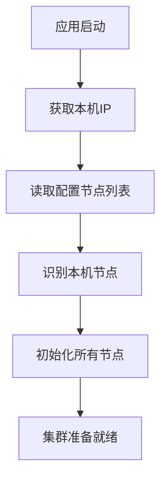
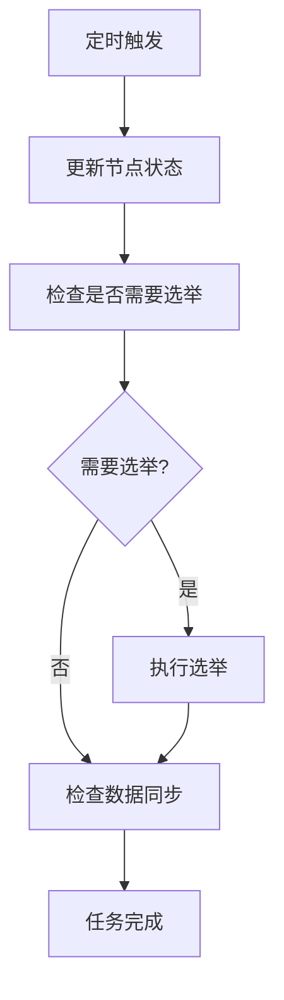

# v4.0 — 集群与主从选举

## 代码结构

```
src/main/java/com/malinghan/maregistry/
├── MaregistryApplication.java          # Spring Boot 入口（无变化）
├── MaRegistryController.java           # REST控制器，新增集群API接口
├── MaRegistryConfig.java               # 配置类，启用配置属性支持
├── MaExceptionHandler.java             # 全局异常处理器（无变化）
├── ExceptionResponse.java              # 异常响应封装类（无变化）
├── model/
│   └── InstanceMeta.java               # 服务实例数据模型（无变化）
├── service/
│   ├── RegistryService.java            # 注册服务接口（无变化）
│   └── MaRegistryService.java          # 内存实现（无变化）
├── health/
│   ├── HealthChecker.java              # 健康检查接口（无变化）
│   └── MaHealthChecker.java            # 健康检查实现（无变化）
└── cluster/
    ├── Server.java                     # 新增：集群节点模型
    ├── Cluster.java                    # 新增：集群管理器
    ├── Election.java                   # 新增：选举算法实现
    ├── ServerHealth.java               # 新增：集群健康检查
    └── MaRegistryConfigProperties.java # 新增：配置属性类
```

## 核心功能实现

### 1. 集群节点模型 (Server.java)

#### 节点属性设计
```java
private final String url;    // 节点访问地址
private boolean status;      // 在线状态
private boolean leader;      // 是否为Leader
private long version;        // 数据版本号
```

#### 核心功能
- **URL解析**：自动解析主机地址和端口号
- **本机识别**：智能识别当前运行节点
- **状态管理**：跟踪节点在线/离线状态
- **版本控制**：支持数据同步的版本管理

### 2. 集群管理 (Cluster.java)

#### 集群初始化流程


#### 核心职责
- **节点发现**：自动识别和管理集群节点
- **状态维护**：跟踪所有节点的实时状态
- **Leader管理**：维护当前Leader节点信息
- **本机识别**：准确识别当前运行的节点

### 3. 选举算法 (Election.java)

#### HashCode确定性选举
```java
// 选举算法核心逻辑
Server leaderCandidate = null;
int minHashCode = Integer.MAX_VALUE;

for (Server candidate : onlineServers) {
    int hashCode = candidate.getUrl().hashCode();
    if (hashCode < minHashCode) {
        minHashCode = hashCode;
        leaderCandidate = candidate;
    }
}
```

#### 算法特点
- **确定性**：相同输入产生相同结果
- **简单高效**：O(n)时间复杂度
- **无需协调**：各节点独立计算
- **公平性**：基于URL哈希值选择

### 4. 集群健康检查 (ServerHealth.java)

#### 定时任务执行
- **执行周期**：每5秒执行一次
- **任务内容**：状态更新 → 选举检查 → 数据同步
- **健康探活**：通过HTTP调用/info接口检查节点可达性

#### 核心流程


### 5. 配置管理 (MaRegistryConfigProperties.java)

#### 配置属性
```properties
maregistry.server-list[0]=http://192.168.1.100:8081
maregistry.server-list[1]=http://192.168.1.101:8081
maregistry.my-url=http://192.168.1.100:8081
maregistry.cluster-mode=true
maregistry.heartbeat-interval=5000
maregistry.node-timeout=15000
```

#### 配置特点
- **外部化配置**：支持properties/yaml格式
- **类型安全**：明确的数据类型定义
- **默认值支持**：关键配置项提供合理默认值
- **验证机制**：内置配置有效性检查

## 新增API接口

### 集群信息接口

#### 1. 获取当前节点信息
```
GET /info
响应示例：
{
  "url": "http://192.168.1.100:8081",
  "status": true,
  "leader": false,
  "version": 10
}
```

#### 2. 获取集群所有节点
```
GET /cluster
响应示例：
[
  {
    "url": "http://192.168.1.100:8081",
    "status": true,
    "leader": true,
    "version": 10
  },
  {
    "url": "http://192.168.1.101:8081", 
    "status": true,
    "leader": false,
    "version": 8
  }
]
```

#### 3. 获取当前Leader
```
GET /leader
响应示例：
{
  "url": "http://192.168.1.100:8081",
  "status": true,
  "leader": true,
  "version": 10
}
```

#### 4. 手动设置Leader（测试接口）
```
POST /sl
响应示例：
{
  "message": "当前节点已设置为Leader",
  "leader": {
    "url": "http://192.168.1.100:8081",
    "status": true,
    "leader": true,
    "version": 10
  }
}
```

## 测试流程

### 单节点测试

#### 1. 启动单节点实例
```bash
# 当前使用YAML配置格式，配置已在application.yml中
# 启动服务（使用8083端口避免冲突）
mvn spring-boot:run -Dspring-boot.run.arguments="--server.port=8083"
```

#### 2. 验证集群接口
```bash
# 获取当前节点信息
curl "http://localhost:8083/info"

# 获取集群信息
curl "http://localhost:8083/cluster"

# 获取Leader信息
curl "http://localhost:8083/leader"
```

预期结果：
- 节点状态为在线
- 当前节点既是成员也是Leader
- 集群只有一个节点
- 配置正确从YAML文件加载

### 多节点集群测试

#### 1. 配置三节点集群
在`application.yml`中配置：
```yaml
spring:
  application:
    name: maregistry

maregistry:
  server-list:
    - http://localhost:8081
    - http://localhost:8082
    - http://localhost:8083
```

#### 2. 启动三个节点实例
```bash
# 终端1：启动节点1（Leader节点）
mvn spring-boot:run -Dspring-boot.run.arguments="--server.port=8081"

# 终端2：启动节点2（Follower节点）
mvn spring-boot:run -Dspring-boot.run.arguments="--server.port=8082"

# 终端3：启动节点3（Follower节点）
mvn spring-boot:run -Dspring-boot.run.arguments="--server.port=8083"
```

#### 3. 验证选举结果
分别在三个节点上执行：
```bash
curl "http://localhost:8081/leader"
curl "http://localhost:8082/leader" 
curl "http://localhost:8083/leader"
```

预期结果：
- 所有节点返回相同的Leader信息
- Leader选择具有一致性和确定性

#### 4. 测试Leader故障转移
```bash
# 停止当前Leader节点（8081端口）
# 观察其他节点的选举过程

# 在剩余节点上查询新的Leader
curl "http://localhost:8082/leader"
curl "http://localhost:8083/leader"
```

预期结果：
- 剩余节点能正确选举出新的Leader
- 选举结果在所有节点上保持一致
- 新Leader从剩余节点中基于hashCode算法选出

### 手动测试接口

#### 1. 手动设置Leader
```bash
# 在8082节点上强制设置为Leader
curl -X POST "http://localhost:8082/sl"

# 验证所有节点的Leader信息
curl "http://localhost:8081/leader"
curl "http://localhost:8082/leader"
curl "http://localhost:8083/leader"
```

预期结果：
- 8082节点被成功设置为Leader
- 所有节点返回相同的Leader信息
- 集群状态保持一致性

## 关键设计特点

### 1. 确定性选举算法
- **算法简单**：基于URL hashCode选择最小值
- **结果一致**：所有节点独立计算得出相同结果
- **无需协调**：避免复杂的分布式协调开销
- **公平选择**：每个节点都有被选为Leader的机会

### 2. 自动化的集群管理
- **节点自动发现**：启动时自动识别集群成员
- **本机智能识别**：自动检测当前运行节点
- **状态实时更新**：定期探活维护节点状态
- **配置驱动**：通过配置文件灵活管理集群

### 3. 健壮的健康检查
- **多层次检查**：状态更新 → 选举检查 → 数据同步
- **优雅降级**：单节点模式下正常工作
- **异常容忍**：个别节点故障不影响整体功能
- **资源管理**：支持优雅启动和关闭

### 4. 灵活的配置管理
- **外部化配置**：支持YAML和Properties多种配置格式
- **层次化结构**：YAML格式提供清晰的配置层次结构
- **默认值机制**：关键参数提供合理默认值
- **验证保护**：配置有效性检查防止错误配置
- **易于扩展**：支持未来添加新的配置项

## 性能与可靠性考虑

### 性能优化
- **轻量级选举**：O(n)时间复杂度的简单算法
- **批量状态更新**：减少网络请求次数
- **异步任务执行**：避免阻塞主线程
- **连接池复用**：HTTP客户端连接池优化

### 可靠性保障
- **故障检测**：定期探活及时发现节点故障
- **自动恢复**：Leader故障时自动重新选举
- **状态一致性**：确保集群状态在所有节点间同步
- **优雅关闭**：应用关闭时正确清理资源

## 后续优化方向

1. **增强选举算法**：实现更复杂的选举算法（如Raft）
2. **数据同步机制**：完善Follower向Leader的数据同步
3. **安全认证**：添加节点间通信的安全认证
4. **监控告警**：集成监控系统和告警机制
5. **动态扩容**：支持运行时动态添加/移除节点
6. **网络分区处理**：增强对网络分区场景的处理能力