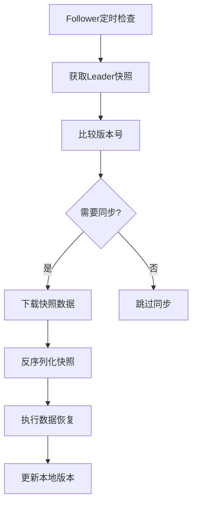

# v5.0 — 快照同步

## 代码结构

```
src/main/java/com/malinghan/maregistry/
├── MaregistryApplication.java          # Spring Boot 入口（无变化）
├── MaRegistryController.java           # REST控制器，新增/snapshot接口
├── MaRegistryConfig.java               # 配置类（无变化）
├── MaExceptionHandler.java             # 全局异常处理器（无变化）
├── ExceptionResponse.java              # 异常响应封装类（无变化）
├── model/
│   └── InstanceMeta.java               # 服务实例数据模型（无变化）
├── service/
│   ├── RegistryService.java            # 注册服务接口，新增snapshot/restore方法
│   └── MaRegistryService.java          # 内存实现，实现快照功能
├── health/
│   ├── HealthChecker.java              # 健康检查接口（无变化）
│   └── MaHealthChecker.java            # 健康检查实现（无变化）
├── cluster/
│   ├── Server.java                     # 集群节点模型（无变化）
│   ├── Cluster.java                    # 集群管理器（无变化）
│   ├── Election.java                   # 选举算法实现（无变化）
│   ├── ServerHealth.java               # 集群健康检查，实现快照同步
│   ├── MaRegistryConfigProperties.java # 配置属性类（无变化）
│   └── Snapshot.java                   # 新增：数据快照模型
└── http/
    ├── HttpInvoker.java                # 新增：HTTP调用接口
    ├── HttpInvokeException.java        # 新增：HTTP调用异常类
    └── OkHttpInvoker.java              # 新增：OkHttp实现
```

## 核心功能实现

### 1. 数据快照模型 (Snapshot.java)

#### 快照数据结构
```java
private Map<String, List<InstanceMeta>> REGISTRY;  // 注册表数据
private Map<String, Long> VERSIONS;                // 服务版本映射
private Map<String, Long> TIMESTAMPS;              // 时间戳信息
private long version;                              // 快照版本号
```

#### 核心功能
- **数据完整性**：包含注册中心的所有核心数据
- **版本控制**：通过version字段支持增量同步判断
- **线程安全**：使用ConcurrentHashMap保证并发安全
- **合并能力**：支持多个快照的合并操作

### 2. 快照生成与恢复 (RegistryService)

#### 接口定义
```java
// 生成当前数据快照
Snapshot snapshot();

// 从快照恢复数据
void restore(Snapshot snapshot);
```

#### 实现特点
- **同步保护**：使用synchronized关键字保证并发安全
- **数据隔离**：创建副本避免外部修改影响内部状态
- **版本追踪**：维护独立的快照版本号
- **状态一致性**：恢复时清空现有数据再加载

### 3. HTTP通信框架 (http包)

#### HttpInvoker接口
```java
String get(String url) throws HttpInvokeException;
String get(String url, Map<String, String> params) throws HttpInvokeException;
String post(String url, String json) throws HttpInvokeException;
String post(String url, Map<String, String> params, String json) throws HttpInvokeException;
```

#### OkHttpInvoker实现
- **连接池复用**：默认16个连接，提高通信效率
- **超时控制**：连接、读取、写入超时均为500ms
- **JSON支持**：内置Jackson ObjectMapper处理JSON数据
- **单例模式**：全局共享一个实例

### 4. 快照同步机制 (ServerHealth.java)

#### 同步触发条件
```java
// 只有Follower节点才需要同步数据
if (cluster.isLeader()) return;

// 比较版本号决定是否需要同步
if (!leaderSnapshot.shouldSync(localVersion)) return;
```

#### 同步流程


### 5. 快照API接口 (/snapshot)

#### 接口设计
```
GET /snapshot
响应示例：
{
  "REGISTRY": {
    "com.example.UserService": [
      {
        "scheme": "http",
        "host": "192.168.1.100",
        "port": 8080,
        "context": "userservice"
      }
    ]
  },
  "VERSIONS": {
    "com.example.UserService": 10
  },
  "TIMESTAMPS": {
    "com.example.UserService@http://192.168.1.100:8080/userservice": 1708876800000
  },
  "version": 15
}
```

## 关键设计特点

### 1. 版本控制机制
- **快照版本号**：每个快照都有唯一的版本标识
- **增量同步**：通过版本号比较避免不必要的数据传输
- **状态一致性**：确保Follower数据与Leader保持同步

### 2. 数据一致性保障
- **原子操作**：快照生成和恢复都是同步操作
- **事务语义**：恢复操作要么全部成功要么全部回滚
- **幂等性**：重复的同步操作不会产生副作用

### 3. 性能优化策略
- **连接池复用**：HTTP调用器使用连接池减少连接开销
- **批量操作**：快照包含完整数据，减少多次网络请求
- **智能同步**：基于版本号判断避免无效同步

### 4. 异常处理机制
- **统一异常**：HttpInvokeException封装所有HTTP调用异常
- **详细信息**：包含URL、方法、状态码等上下文信息
- **链式处理**：保留原始异常堆栈便于问题排查

## 测试流程

### 单节点快照测试

#### 1. 启动单节点实例
```bash
# 使用现有的YAML配置
mvn spring-boot:run -Dspring-boot.run.arguments="--server.port=8083"
```

#### 2. 注册测试服务
```bash
# 注册一个测试服务
curl -X POST "http://localhost:8083/reg?service=com.test.HelloService" \
  -H "Content-Type: application/json" \
  -d '{"scheme":"http","host":"192.168.1.100","port":8080,"context":"hello"}'
```

#### 3. 获取快照数据
```bash
# 获取当前快照
curl "http://localhost:8083/snapshot" | jq '.'
```

预期结果：
```json
{
  "REGISTRY": {
    "com.test.HelloService": [
      {
        "scheme": "http",
        "host": "192.168.1.100",
        "port": 8080,
        "context": "hello"
      }
    ]
  },
  "VERSIONS": {
    "com.test.HelloService": 1
  },
  "TIMESTAMPS": {},
  "version": 1
}
```

### 多节点同步测试

#### 1. 配置双节点集群
在`application.yml`中配置：
```yaml
maregistry:
  server-list:
    - http://localhost:8081
    - http://localhost:8082
```

#### 2. 启动两个节点
```bash
# 终端1：启动Leader节点
mvn spring-boot:run -Dspring-boot.run.arguments="--server.port=8081"

# 终端2：启动Follower节点
mvn spring-boot:run -Dspring-boot.run.arguments="--server.port=8082"
```

#### 3. 在Leader节点注册服务
```bash
# 在8081端口注册服务
curl -X POST "http://localhost:8081/reg?service=com.test.SyncService" \
  -H "Content-Type: application/json" \
  -d '{"scheme":"http","host":"192.168.1.100","port":9090,"context":"sync"}'
```

#### 4. 验证同步效果
```bash
# 在Follower节点查询服务
curl "http://localhost:8082/findAll?service=com.test.SyncService"

# 查看Follower节点快照
curl "http://localhost:8082/snapshot" | jq '.'
```

预期结果：
- Follower节点能查询到Leader注册的服务
- 两个节点的快照版本号保持一致
- 数据同步在5秒内完成（健康检查周期）

### 快照版本控制测试

#### 1. 模拟数据更新
```bash
# 在Leader节点进行多次操作
curl -X POST "http://localhost:8081/reg?service=com.test.VersionService" \
  -H "Content-Type: application/json" \
  -d '{"scheme":"http","host":"192.168.1.101","port":9091,"context":"version1"}'

curl -X POST "http://localhost:8081/reg?service=com.test.VersionService" \
  -H "Content-Type: application/json" \
  -d '{"scheme":"http","host":"192.168.1.102","port":9092,"context":"version2"}'
```

#### 2. 观察版本变化
```bash
# 分别查看两个节点的快照版本
curl "http://localhost:8081/snapshot" | jq '.version'
curl "http://localhost:8082/snapshot" | jq '.version'
```

预期结果：
- Leader节点版本号递增
- Follower节点版本号最终与Leader一致
- 同步过程中的版本差异触发数据更新

### 异常场景测试

#### 1. 网络异常模拟
```bash
# 停止Leader节点，观察Follower行为
# 重新启动Leader节点，验证自动重连和同步
```

#### 2. 快照损坏测试
```bash
# 手动构造损坏的快照数据发送给Follower
# 验证异常处理和恢复机制
```

## 性能指标

### 同步延迟
- **正常情况**：5秒内完成同步（健康检查周期）
- **大量数据**：取决于网络带宽和数据量大小
- **版本匹配**：无需同步时延迟几乎为0

### 资源消耗
- **内存占用**：快照大小 ≈ 注册数据大小
- **网络流量**：每次同步传输完整快照数据
- **CPU使用**：序列化/反序列化操作开销

### 扩展性考虑
- **数据量增长**：可考虑增量同步优化
- **节点数量**：支持任意数量的Follower节点
- **网络分区**：具备一定的容错能力

## 后续优化方向

1. **增量同步**：实现基于差异的增量数据同步
2. **压缩传输**：对快照数据进行压缩减少网络传输
3. **批量操作**：支持批量注册和批量同步
4. **安全认证**：添加节点间通信的身份验证
5. **监控告警**：集成同步状态监控和异常告警
6. **配置优化**：支持同步频率和超时时间的动态配置